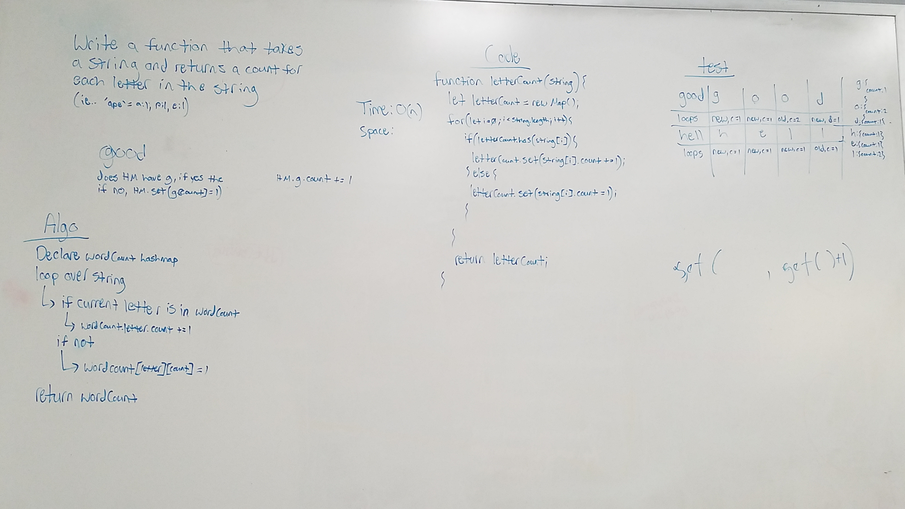

# Letter Count

Write a function that takes in a string and returns the amount of times each letter occurs in the string.

## Running the tests

1. Testing to ensure correct output on basic string
2. Testing to ensure undefined output on non-string input
3. Testing to ensure correct output on string with a space
4. Testing to ensure correct output on string with uppercase and lowercase letters

